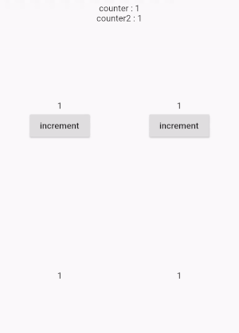

# inherited_store

An inherited widget that holds data and rebuilds the widgets whom depend on the changed data.

This package uses `InharitedModel` as its base.

### Advantages

1. lightweight (less that 100 lines of code)
2. uses flutter's own `InheritedModel` & `InheritedModel` for detecting what needs to be rebuilt.
3. no boilerplate code 

### Disadvantages
   
1. no computed values

## Example



The code for the example is in the example tab. 

## Getting Started

### Step 1: Wrap your app with Store

```dart
    Store(
      data: {
        'counter': 1,
      },
      child: MaterialApp(
        /* ... */
      ),
    );
```

### Step 2: Use it

```dart
class CounterText extends StatelessWidget {
  
  @override
  Widget build(BuildContext context) {
    return Text(Store.of(context, 'counter').get().toString()); 
  }
}
```

If you edit `counter` using `Store.of(context,'counter').set(2)` the CounterText widget
will be automatically rebuilt.

### What exactly gets rebuilt?
When you call `Store.of(context,key)` all the widgets that use the current `context`
will be subscribed to changes for that key.
If the value for the key changes the widget that uses the subscribed context will be rebuilt.

In the Example bellow, when the `counter` is modified,
only the text widget inside the builder gets updated
because it was subscribed using the `c` context and only decedents of `c` will be rebuilt.
If instead of calling `Store.of(c,'counter')` we called `Store.of(context,'counter')`,
when `counter` changes, the entire widget will get rebuilt and the text that shows the time will also update.

```dart
class StoreText extends StatelessWidget {
  @override
  Widget build(BuildContext context) {
    return Column(
      children: <Widget>[
        Text(DateTime.now().toString()), // show the time which this text widget was built
        Builder(builder: (c) {
          return Text(Store.of(c, 'counter').get().toString());
        }),
      ],
    );
  }
}
```

## Example use cases

### UnMutable Data Management

Things that are stored in the data map should only be replaced with the `set` method.

```dart
  Store(
    data: {
       UnmodifiableListView<Post> : UnmodifiableListView<Post>([]), // using add on a list will not notify subscribers
       User : User.savedUser, 
       MyService : MyService,
       AppTheme : AppTheme(),
       420 : false, // a key can be anything
       'balance' : 12000,
    },
    child: MaterialApp(
      /* ... */
    ),
  );
``` 

### Managing App Preferences

You can use `Inherited_Store` to effectively manage your app preferences.
Load your preferences into the `data` field of the store then update the stored preferences using the `onValueModified` callback.

[1]: https://pub.dev/packages/flutter_store